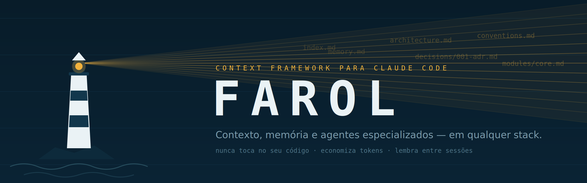

<p align="center">
  
</p>

# Farol — v2.0.2

**Contexto, memória e agentes especializados para o Claude Code — em qualquer stack.**
*Farol ("lighthouse"): project context, memory and specialized agents for Claude Code, on any stack. Docs in Brazilian Portuguese.*

Como um farol: guia o Claude pelo seu projeto **sem nunca tocar no código**,
ilumina apenas o necessário (economia de tokens) e permanece aceso entre
sessões (memória persistente).

> Projeto independente, não afiliado nem endossado pela Anthropic.
> Claude Code é um produto da Anthropic.

## English — quick start

Farol ("lighthouse") gives Claude Code durable, token-efficient knowledge of
your project: it detects your stack, maps architecture, commands and
**inviolable product/legal constraints**, and remembers across sessions —
while never touching your source code. Team docs always take precedence;
three modes (adopt / augment / bootstrap) match how documented your project
already is. Battle-tested through four adversarial field reports (see
CHANGELOG).

```
/plugin marketplace add ZaqueuLopesDaSilvaAraujo/farol
/plugin install farol@farol
```

Then, in each project: `/farol:init` → `/farol:contextualize`. Day-to-day:
`/farol:status`, `/farol:update`, `/farol:decision`, `/farol:consolidate`.
Full documentation is in Brazilian Portuguese; the skills work in any
language your project uses.


O Farol é uma camada fina e reutilizável que transforma o Claude Code em um
assistente especializado em **qualquer** projeto, separando:

- **Inteligência** (agents e skills `fw-*`): genérica, permanente, atualizável.
- **Contexto** (`.claude/context/`): específico do projeto, propriedade do time,
  jamais tocado por upgrades do framework.

Funciona em qualquer stack (Node, Python, Java, .NET, Go, Rust, monorepos,
CLI, mobile, Electron...) porque nenhum arquivo `fw-*` contém conhecimento
de projeto: todo conhecimento específico é descoberto na contextualização.

## Quando usar — e quando não usar

O Farol resolve um problema específico: **codebase média/grande ou pouco
documentada, onde o agente desperdiça contexto redescobrindo tudo**. Fora
desse caso, seja honesto consigo:

- Projeto pequeno com documentação artesanal densa? O modo **adopt** faz o
  índice apontar para os seus docs (AGENTS.md etc.) em vez de parafraseá-los
  — e a documentação do time SEMPRE prevalece sobre o Farol em divergências.
  O que o adopt muda é a pergunta da contextualização: de "descreva o
  projeto" para **"o que é verdade e não está na doc"** — lacunas e
  divergências verificadas, com fonte. Expectativa honesta (medida em
  campo): adopt entrega fidelidade e precedência, NÃO redução de tokens; a
  seção de princípios invioláveis é conteúdo novo que custa — e vale — seu
  espaço. O `contextBudget` existe para vigiar esse custo, não para
  prometer queda.
- Documentação parcial (um README com comandos, sem regras de produto)? O
  modo **augment** aproveita o que existe e cria apenas as lacunas.
- Dúvida pontual num arquivo? Grep responde de graça; nenhum framework de
  contexto compete com isso, nem deve.
- Só quer economia de tokens na doc existente? Adote apenas o padrão da
  tabela "Carregue quando" (núcleo always-on + seções sob demanda), sem
  instalar nada. É a melhor ideia daqui e é sua de graça.

## Instalação (plugin — 2 comandos)

```
/plugin marketplace add ZaqueuLopesDaSilvaAraujo/farol
/plugin install farol@farol
```

Depois, em cada projeto: `/farol:init` → `/farol:contextualize`. Detalhes,
instalação local por zip e migração da 1.x: `INSTALL.md` e `UPGRADE.md`.
A inteligência (skills e agents) mora no plugin, instalada uma vez por
máquina; o conhecimento de cada projeto mora em `.claude/context/`,
versionado junto com ele.

## Comandos

| Comando | Função |
|---|---|
| `/farol:init [--mode adopt\|augment\|bootstrap]` | Instala, detecta stack e maturidade documental, recomenda o modo, preserva arquivos com backup |
| `/farol:contextualize` | Descobre arquitetura, módulos, comandos e convenções e preenche o contexto |
| `/farol:update` | Atualização incremental do contexto (ancorada em `git diff`) |
| `/farol:consolidate` | Consolida a memória: deduplica, promove decisões, remove efêmeros |
| `/farol:decision "título"` | Registra uma decisão arquitetural (ADR curto) |
| `/farol:status` | Verifica frescor e saúde do contexto |

## Subagents

- `fw-scout` — explora o repositório em contexto isolado e devolve resumos.
- `fw-reviewer` — revisa mudanças sob 4 lentes: qualidade, segurança, performance, testes.
- `fw-debugger` — investiga falhas com ciclo de hipóteses, sem poluir a conversa.

Implementação e arquitetura acontecem na **sessão principal** (que conhece a
conversa inteira). Subagents existem apenas onde o isolamento de contexto é
vantagem: tarefas que leem muito e devolvem pouco.

## Segurança

O framework nunca altera código-fonte, instala dependências, faz commit/push
ou executa comandos destrutivos sem autorização explícita. Além das regras
declarativas, o hook opcional `fw-guard.sh` (PreToolUse) **bloqueia**
deterministicamente comandos destrutivos. Veja `.claude/hooks/README.md`.

## Atualização do framework

Nativa do Claude Code: `/plugin` → marketplace `farol` → update. A
atualização do plugin nunca toca no seu projeto; `.claude/context/` é seu.
Migrações de esquema, quando existirem, ficam em `UPGRADE.md`.

## Economia de tokens (mecanismos)

1. Always-on = apenas `context/index.md` (~1–2k tokens), via import no CLAUDE.md.
2. Todo o resto carrega sob demanda, guiado pela tabela "carregue quando" do índice.
3. Leituras pesadas rodam no `fw-scout` (contexto isolado, retorna só resumo).
4. Contextualização com orçamento duro de leitura e lista de exclusão obrigatória.
5. Atualização incremental ancorada no commit registrado em `manifest.json`.
6. `memory.md` com teto de 150 linhas + consolidação periódica.

Nota de honestidade 2 (v2.0): o plugin em escopo de usuário custa ~0,9k
tokens em toda sessão da máquina, mesmo em projetos sem Farol — documente
`/plugin disable farol` como prática nos projetos que não o usam.

Nota de honestidade: esses mecanismos limitam e vigiam o custo — não
garantem que o total caia em todo cenário. Em modo adopt sobre doc madura,
o custo fixo pode SUBIR (princípios invioláveis, precedência) em troca de
fidelidade; a medição fica no `contextBudget` para você decidir com números.
